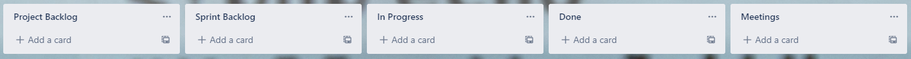
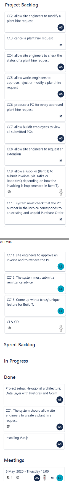
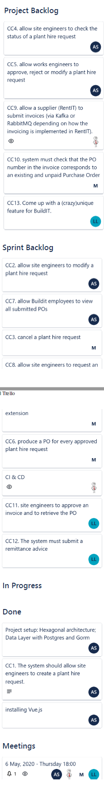
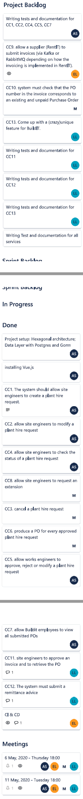
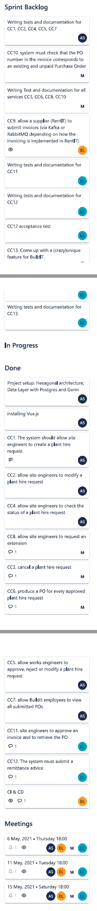
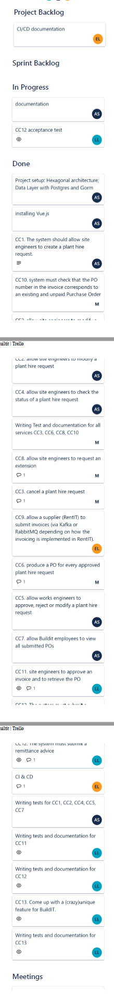
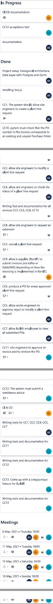
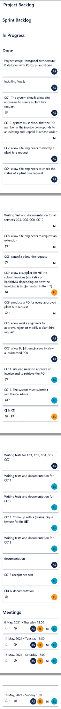
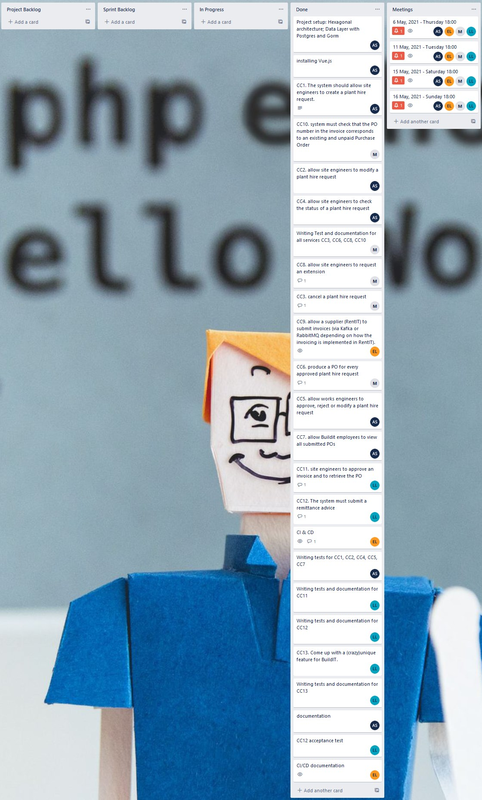

# Project management 
For project management we used Trello board. We had 4 main columns plus one support column. 

For the first meeting we created all of the required tasks and moved those to the "Project Backlog" column.

### First meeting
First meeting took place on the 6th may. We assigned each task to one of us. Board state after that

Then we discussed what we will implment for the next meeting and when will next meeting be. Board state at the end of the meeting.

### Second meeting
Next meeting took place on the 11th may. Board state in the beginning.

We checked what others did and discussed our new sprint goals. Everyone moved their tasks to the "Sprint backlog" to show what everyone will work on. Board at the end of the meeting

### Third meeting
This meeting took place on the 15th may. Board state in the beginning.

We checked what others did and checked what we haven't done yet. 2 main things that we needed to to was documentation and presentation. Board at the end of the meeting.

### Fourth meeting
This were our final meeting. It took place on the 16th may. We discussed our presentation and did our presentation video. Board at the beginnning of the meeting

We did our presentation.

### Final board state
We finished all of the tasks that we defined for us. 

# Meetings
Detailed description what everyone did for the meeting.

## Meeting: 6 May, 2021 - Thursday 18:00
**Stand-ups:** \
\
**Amirabbas Sherafatian:**
-	What did I work on in the past day(s)? \
    Project setup: Hexagonal architecture; Data Layer with Postgres and Gorm (8 hrs)

-	What am I working on?
    backend implementation for CC1, CC2, CC4, CC5, CC7

-	What issues are blocking me?
    Nothing

**Masud Rana:**
-	What did I work on in the past day(s)? \
    Checking out project specification and make implementation ideas.(5hrs)
  
-	What am I working on?
    Backend implementation for CC3, CC6, CC8, CC10

-	What issues are blocking me?
    Nothing

**Lauri Leiten:**
-	What did I work on in the past day(s)? \
    Familiarizing myself with the project specification and thinking about our implementation (about 3 hours)

-	What am I working on?
    Backend implementation for CC11, CC12

-	What issues are blocking me?
    Nothing

**Einar Linde:**
-	What did I work on in the past day(s)? \
    Read the project specification and started thinking of implementation (4 hours)

-	What am I working on?
    CI and CD

-	What issues are blocking me?
    Nothing
    
## Meeting: 11 May, 2021 - Tuesday 18:00
**Stand-ups:** \
\
**Amirabbas Sherafatian:**
-	What did I work on in the past day(s)? \
    backend implementation for CC1, CC2, CC4, CC5, CC7 (8 hrs)

-	What am I working on?
    Tests for CC1, CC2, CC4, CC5, CC7

-	What issues are blocking me?
    Nothing

    **Masud Rana:**
-	What did I work on in the past day(s)? \
    backend implementation for CC3, CC6, CC8.(8hrs) 

-	What am I working on?
    backend implementation for CC10 \
    Tests for CC3, CC6, CC8, CC10

-	What issues are blocking me?
    Nothing

**Lauri Leiten:**
-	What did I work on in the past day(s)? \
    Finished the backend implementation for CC11 and CC12. Started work on testing the CC11. (3 hours)

-	What am I working on?
    Backend implementation for CC13, tests for CC11, CC13.

-	What issues are blocking me?
    Nothing

**Einar Linde:**
-	What did I work on in the past day(s)? \
    CI and CD (6.5 hours)

-	What am I working on?
    CC9 and kafka integration
    Ensuring that CI and CD run properly

-	What issues are blocking me?
    Nothing

## Meeting: 15 May, 2021 - Saturday 18:00
**Stand-ups:** \
\
**Amirabbas Sherafatian:**
-	What did I work on in the past day(s)? \
    Tests for CC1, CC2, CC4, CC5, CC7 (5 hrs)

-	What am I working on?
    documentation

-	What issues are blocking me?
    Nothing

**Masud Rana:**
-	What did I work on in the past day(s)? \
    backend implementation for CC10 \
    Tests for CC3, CC6, CC8, CC10.(12hrs)
  

-	What am I working on?
    documentation

-	What issues are blocking me?
    Nothing

**Lauri Leiten:**
-	What did I work on in the past day(s)? \
    Backend implementation for CC13, tests for CC11, CC13. (5 hours)

-	What am I working on?
    Acceptance test requirements for CC12, documentation for the tests I made, explanation of the unique feature

-	What issues are blocking me?
    Nothing

**Einar Linde:**
-	What did I work on in the past day(s)? \
    CC9 and kafka integration (4.25 hours)
    Ensuring that CI and CD run properly (1 hour)

-	What am I working on?
    CI and CD documentation
    Project management documentation
    Technical documentation
    Ensuring that CI and CD run properly

-	What issues are blocking me?
    Nothing

## Meeting: 16 May, 2021 - Sunday 18:00
**Stand-ups:** \
\
**Amirabbas Sherafatian:**
-	What did I work on in the past day(s)? \
    documentation (2 hrs)

-	What am I working on?

-	What issues are blocking me?
    Nothing

    **Masud Rana**
-	What did I work on in the past day(s)? \
    Documentation & presentaion preparation.(5hrs) 

-	What am I working on?

-	What issues are blocking me?
    Nothing
    
    
**Lauri Leiten:**
-	What did I work on in the past day(s)? \
    Acceptance test requirements for CC12, documentation for the tests I made, explanation of the unique feature, polishing the documentation, presentation (editing, preparation etc) (12 hours)

-	What am I working on?
    -
    
-	What issues are blocking me?
    Nothing

**Einar Linde:**
-	What did I work on in the past day(s)? \
    CI and CD documentation (2 hours)
    Project management documentation (1 hour)
    Technical documentation (0.25 hours)
    Ensuring that CI and CD run properly (1 hour)

-	What am I working on?
    Presentation (took 4 hours)
    Ensuring that CI and CD run properly

-	What issues are blocking me?
    Nothing
