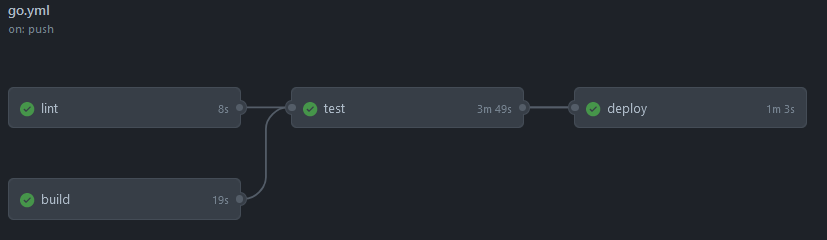
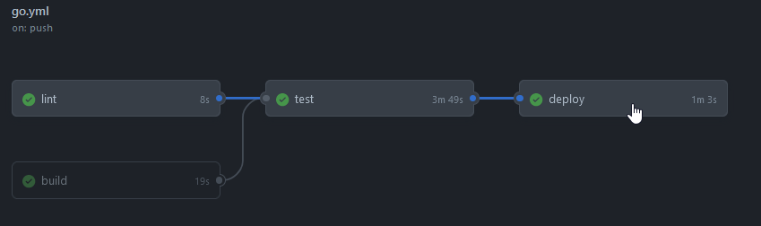
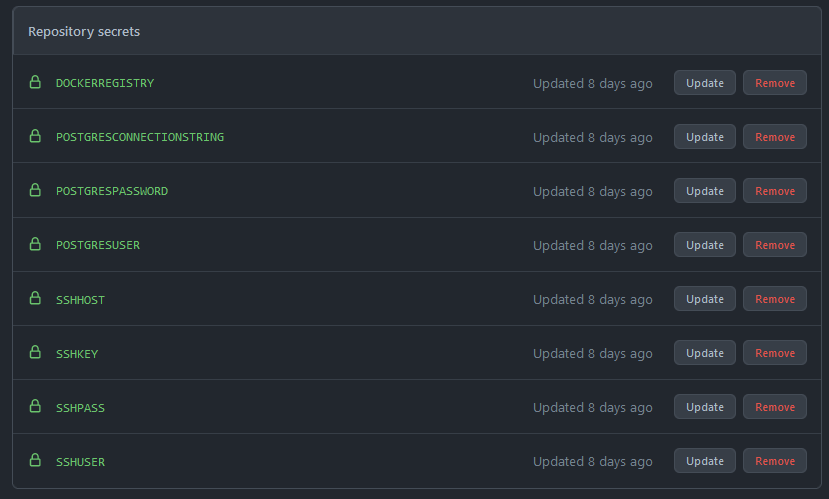
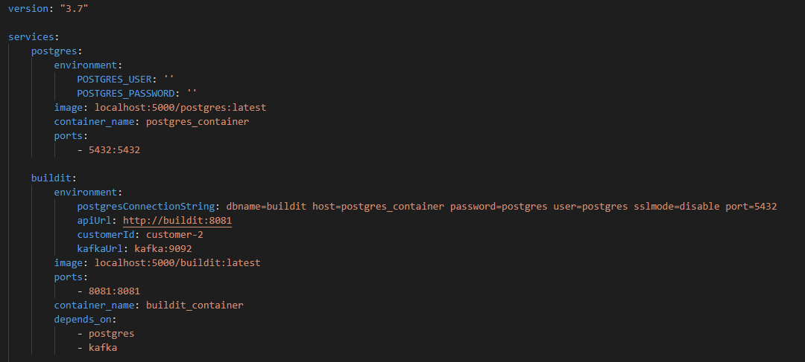

# Technical Documentation

## Architecture
Hexagonal architecture is followed in the web project written in GOLANG.\
Following this architecture, postgress is applied as a database engine and in the data layer we
are exchanging data between the database engine and the web project with the use of Gorm, popular
ORM library in GO. Also, in this layer the project contains a repository responsible to communicate
with the postgress via Gorm and provide APIs to the service layer. \
The service layer is deriving from an interface which allows to replace the repository in the future if
it is needed. This layer will provide the functionalities to the UI layer. \
The UI layer, as a gateway, will expose all the functionalities to the outside via http APIs, meaning
transferring raw data (DTOs) into the client. This will provide an opportunity to be capable of creating
multiple client application using the same backend. \

## Accessible APIs via HTTP

**URI:** /requests/new \
**Method:** POST \
**Parameters:** plantName [string], siteName [string], supplierName [string], requesterName [string], startDate [time.Time], endDate [time.Time], totalHiringCost [float64], status [int64] \
**Output:** ID [int64], PlantName [string], SiteName [string], SupplierName [string], RequesterName [string], StartDate [time.Time], EndDate [time.Time], TotalHiringCost [float64], Regulator [string], WorkEngineerComment [string], StatusCode [int64], StatusDesc [string] \
**Description:** To Make a new request to hire a plant \
\
**URI:** /requests/modifyBySiteEngineers \
**Method:** POST \
**Parameters:** ID [int64], plantName [string], siteName [string], supplierName [string], requesterName [string], startDate [time.Time], endDate [time.Time], totalHiringCost [float64], status [int64] \
**Output:** nil or error \
**Description:** To modify the request for hiring a plant by site engineers \
\
**URI:** /requests/get/{Id} \
**Method:** GET \
**Parameters:** Id [int64]
**Output:** ID [int64], PlantName [string], SiteName [string], SupplierName [string], RequesterName [string], StartDate [time.Time], EndDate [time.Time], TotalHiringCost [float64], Regulator [string], WorkEngineerComment [string], StatusCode [int64], StatusDesc [string] \
**Description:** To retreive the corresponding saved plant request information and the status \
\
**URI:** /requests/modifyByWorkEngineers \
**Method:** POST \
**Parameters:** ID [int64], plantName [string], siteName [string], supplierName [string], requesterName [string], startDate [time.Time], endDate [time.Time], totalHiringCost [float64], status [int64] \
**Output:** nil or error \
**Description:** To modify the request for hiring a plant by work engineers \
\
**URI:** /requests/accept \
**Method:** POST \
**Parameters:** RequestId [int64], Regulator [string], Comment [string] \
**Output:** nil or error \
**Description:** To approve the request made by site engineers \
\
**URI:** /requests/reject \
**Method:** POST \
**Parameters:** RequestId [int64], Regulator [string], Comment [string] \
**Output:** nil or error \
**Description:** To reject the request made by site engineers \
\
**URI:** /orders/getAll \
**Method:** GET \
**Parameters:** nothing \
**Output:** OrderID [int64], RequestID [int64], PlantName [string], SiteName [string], SupplierName [string], RequesterName [string], StartDate [time.Time], EndDate [time.Time], TotalHiringCost [float64], Regulator [string], WorkEngineerComment [string], RequestStatus [int64], RequestStatusDesc [string], OrderStatus [int64], OrderStatusDesc [string], InvoiceStatus [int64], InvoiceStatusDesc [string] \
**Description:** To retreive the full detail of all the orders approved \
\
**URI:** /requests/cancel/{requestId}/{requesterName}/{comment} \
**Method:** POST \
**Parameters:** requestId [int64], requesterName [string], comment [string] \
**Output:** nil or error \
**Description:** To cancel the request made by site engineers \
\
**URI:** /requests/generatePO/{plantHireRequestID} \
**Method:** POST \
**Parameters:** plantHireRequestID [int64] \
**Output:** ID [int64], RequestID [int64], Status [int64] \
**Description:** To generate order for the approved request \
\
**URI:** /requests/extension/{plantHireRequestID}/{endDate} \
**Method:** POST \
**Parameters:** plantHireRequestID [int64], endDate [time.Time] \
**Output:** ID [int64], RequestID [int64], Status [int64] \
**Description:** To extend the order \
\
**URI:** /requests/delete/{supplierName} \
**Method:** DELETE \
**Parameters:** supplierName [string] \
**Output:** ID [int64], plantName [string], siteName [string], supplierName [string], requesterName [string], startDate [time.Time], endDate [time.Time], totalHiringCost [float64], status [int64] \
**Description:** To delete all the orders associated with the given supplier \
\
**URI:** /invoices/{invoiceId}/accept/{regulator}/{comment} \
**Method:** POST \
**Parameters:** invoiceId [int64], regulator [string], comment [string] \
**Output:** Id [int64], PurchaseOrderID [int64], Amount [float64], Regulator [string], Comment [string], StatusCode [int64], StatusDesc [string] \
**Description:** To accept the invoice \
\
**URI:** /invoices/{invoiceId}/reject/{regulator}/{comment} \
**Method:** POST \
**Parameters:** invoiceId [int64], regulator [string], comment [string] \
**Output:** Id [int64], PurchaseOrderID [int64], Amount [float64], Regulator [string], Comment [string], StatusCode [int64], StatusDesc [string] \
**Description:** To reject the invoice \
\
**URI:** /invoices/{invoiceId}/purchaseOrder \
**Method:** GET \
**Parameters:** invoiceId [int64] \
**Output:** OrderID [int64], RequestID [int64], PlantName [string], SiteName [string], SupplierName [string], RequesterName [string], StartDate [time.Time], EndDate [time.Time], TotalHiringCost [float64], Regulator [string], WorkEngineerComment [string], RequestStatus int64], RequestStatusDesc [string], OrderStatus [int64], OrderStatusDesc [string], InvoiceStatus [int64], [InvoiceStatusDesc] \
**Description:** To retreive the purchase order associated with the given invoice ID \
\
**URI:** /invoices/{invoiceId} \
**Method:** GET \
**Parameters:** invoiceId [int64] \
**Output:** Id [int64], PurchaseOrderID [int64], Amount [float64], Regulator [string], Comment [string], StatusCode [int64], StatusDesc [string] \
**Description:** To retreive the invoice \
\
**URI:** /invoices/checkInvoice \
**Method:** POST \
**Parameters:** ID [int64], PurchaseOrderID [int64], Amount [float64], Regulator: [string], Comment [string], Status [int64] \
**Output:** nil or error \
**Description:** If no error returned then its OK to proceed further with the invoice \

## External Tests
**TestName:** TestNewPlantHireRequest \
**Test Case:** Ensures making a new request and checks if the same object is saved and its status is pending \
\
**TestName:** TestModifyRequestBySiteEngineersRejectionTest \
**Test Case:** Ensures modification by site engineers is not allowed if the request is approved \
\
**TestName:** TestModifyRequestBySiteEngineersAcceptanceTest \
**Test Case:** Ensures modification by site engineers if the request is not approved yet \
\
**TestName:** TestGetPlantHireRequestById \
**Test Case:** Ensures retreiving a request by its id \
\
**TestName:** TestModifyRequestByWorkEngineers \
**Test Case:** Ensures work engineers can modify the requests without any limitation \
\
**TestName:** TestAcceptRequest \
**Test Case:** Ensures work engineers can accept requests \
\
**TestName:** TestRejectRequest \
**Test Case:** Ensures work engineers can reject requests \
\
**TestName:** TestGetCompleteOrders \
**Test Case:** Ensures all the orders can be retreived: a new request made, accepted, corrsepondant order created and finally was being checked that order is included in the list retreived by the API \
\
**TestName:** TestApproveInvoice \
**Test Case:** Ensures that the invoice with the given ID is accepted. The API responds to the approval request with the invoice object if the request is successful - that object is then checked that it contains the correct information (the names are correct and the status is Accepted) \
\
**TestName:** TestRejectInvoice \
**Test Case:** Ensures that the invoice with the given ID is rejected. The API responds to the rejection request with the invoice object if the request is successful - that object is then checked that it contains the correct information (the names are correct and the status is Rejected) \
\
**TestName:** TestGetPurchaseOrderById \
**Test Case:** Tests the retrieval of a purchase order associated with a invoice ID. The only verification here is that the response from the API is the complete purchase order. \
\
**TestName:** TestPlantRequestDeletion \
**Test Case:** Tests the total deletion of plant requests associated with a specified supplier. The test first inserts a new plant request and then tries to delete all requests with the correct supplier name. If the deletion was successful the API respons with an array of all the deleted objects. The objects are all checked that the supplier name matches the specified supplier.
\
**TestName:** TestReceivingValidInvoice \
**Test Case:**  We don't have really good way how to test it because sending into kafka doesn't send respond and because requirement is that when invoice is received info is written into **stdout**. There isn't really possibility to check api's stdout from test. Also it takes time for server to handle new messages from kafka. Receiving invoice is goroutine and we don't know exact moment when invoice is receieved from kafka so we can't wait for it. Because of that we only check if sending to kafka is successful. This requirement should be ideally checked with unit test because then we know exact moment when invoice is received. But unit tests aren't required by project specification.

## CI/CD
CI and CD was implemented using Github actions. There are 4 stages. Lint, build, test and deploy stages

Lint and build stage can be run in parallel because they are separate enough and linter only helps to imporive code quality. Test stage depends on build stage because it is useless to run test when build fails. 

Tests are ran using docker. Docker-compose.yml builds buildit-test and buildit images and also other required images like postgres, zookeeper and kafka. After that it runs test images and it will fail if some of the tests aren't successful. If tests are passed then it pushes postgres and buildit images to private docker registry. Using private registry gives us more control over history of successful images. Each image is tagged with build number. That allows redeploying previous version just by getting that image from repository and running it. 

Deploy stages depends on test and lint stage.
 
Because deploy should happen only when everything is okay. Deploy pulls images from our private registry and tags them with "latest" tag so that in docker-compose file we can use "builit:latest". For deploying it uses deploy/docker-compose.yml script with correct environment variables. More about environment variables in deploy section. Api is deployed to our hetzner machine i.e 95.216.188.131

Sensitive infomation are stored in github secrets so that it isn't needed to push sensitive information into the repository. 
 
Secrets are injected into workflow file. 

This kind of system allows us to easily deploy our application to the new environment. We just need one configurated docker-compose.yml file to deploy the application. 

If for some reason we deployed wrong image to the registry then we can easily revert it by tagging previous version as the latest or rerunning one of the previous build that retags one of the previous image. In all of the environments we need to run command "docker-compose pull && docker-compose up" and we have updated our application.

## Deployment

To deploy application into new environment we need docker-compose.yml file from deploy folder. Values that need to change are in the buildit and postgres services. 
 
In postgres services choose **POSTGRES_USER** and **POSTGRES_PASSWORD**. If you already have postgres database then you can delete postgres part of that file. 
Also from that picture you can see that it pulls images from the private registry on the same machine. You should also change private registry location. 
I.e Change "localhost:5000/postgres:latest" to "95.216.188.131:5000/postgres:latest" (same with buildit service). Note: You might need to allow pulling from insecure registry for that. 

In postgres service you need correct **postgresConnectionString** environment variable so that you can connect to correct database. 

**apiUrl** should remain same or when you have proper "rentit" application change it to that.  

**customerId** is used to get invoices from kafka. Rentit application will send invoices to kafka and buildit will automatically read from that an process it.

**kafkaUrl** should remain as is when using kafka that is deployed with this docker-compose file. 

When docker-compose file is ready then run command **docker-compose pull && docker-compose up** and you you have functioning application. 